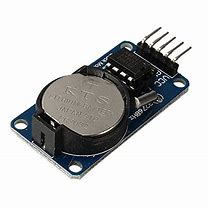

# Clock DS1302 Codes




This repository contains code snippets for interfacing with the **DS1302** real-time clock module and displaying current time on 16X2 LCD using MicroPython. The DS1302 is a low-power, real-time clock IC that provides timekeeping functions for applications.

### Getting Started

To get started with using the DS1302 clock codes:

Clone the repository: ```git clone https://github.com/Abdulkaif/Clock-ds1302-codes.git```
Connect the DS1302 clock module to your MicroPython-compatible board according to the provided pin connections.
Copy the DS1302.py module to your MicroPython board.
Import the module in your main program and utilize the provided functions to interact with the DS1302 clock.


### Example Usage

Here is a basic example of setting the time using the ds1302.py module:

```
from machine import Pin
import DS1302

ds = DS1302.DS1302(clk=Pin(0), dio=Pin(1), cs=Pin(2))
# Here i have used pins 0,1,2 but you can use any pins of your choice.

# Set the time
ds.year(2021)
ds.month(12)
ds.day(15)
ds.weekday(3)
hour(15)
ds.second(7)
ds.minute(3)

# Start the RTC module

ds.start()

print(f"Time: {str(ds.hour())}:{str(ds.minute())}:{str(ds.second())}")

```

### Contributing

Contributions to the Clock DS1302 Codes repository are welcome! If you have any improvements, bug fixes, or additional examples, feel free to submit a pull request.

### License

This repository is licensed under the MIT License. See the LICENSE file for more information.


